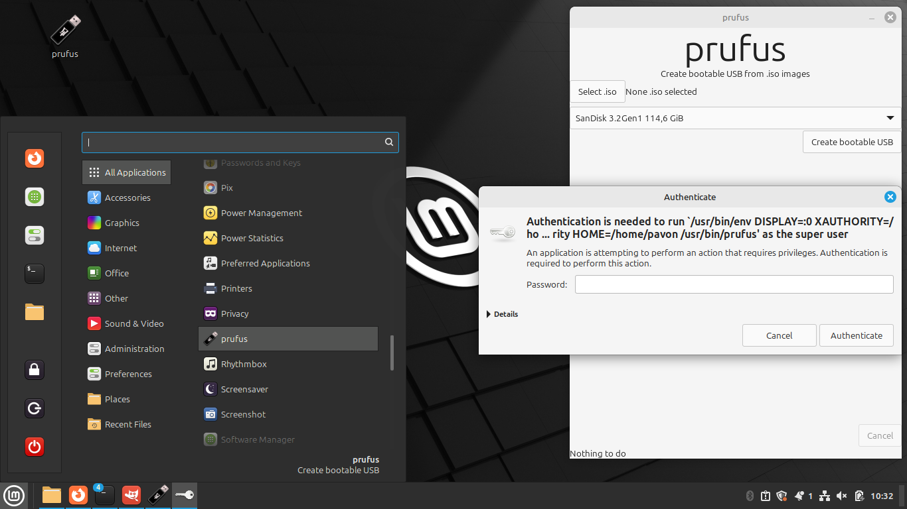

# prufus
### Create bootable USB from .iso images
This program it's only for GNU/Linux

<a href="https://www.google.com/">
  <button></button>
</a>

You can create a bootable USB with Windows installer from GNU/Linux. And then you can install Windows on another computer. Useful for computer repair people or if you want to go back to Windows from Linux after a disappointment.  
This is an open source project with GPL 3 license. That means you can modify it like you want, change the name or even sell it as long as you distribute with your changes to the source code.  

# Warning
Every command for manipulate disks in GNU/Linux are for privilege user. You don't even can seen your USB without "sudo". And the GUI need "sudo" for format the USB.  
This program only work with GPT partitions tables. Only UEFI is supported and only EFI will be supported.
NONE Windows hack here like remove TPM requirement. And never will be implemented neither.

# How to use

You will see an icon in your desktop. Double click on it and enter your password.  
Select the .iso file and click on "Create bootable USB"

You can ask in:
[Threads](https://www.threads.net/@oscar0pavon)
